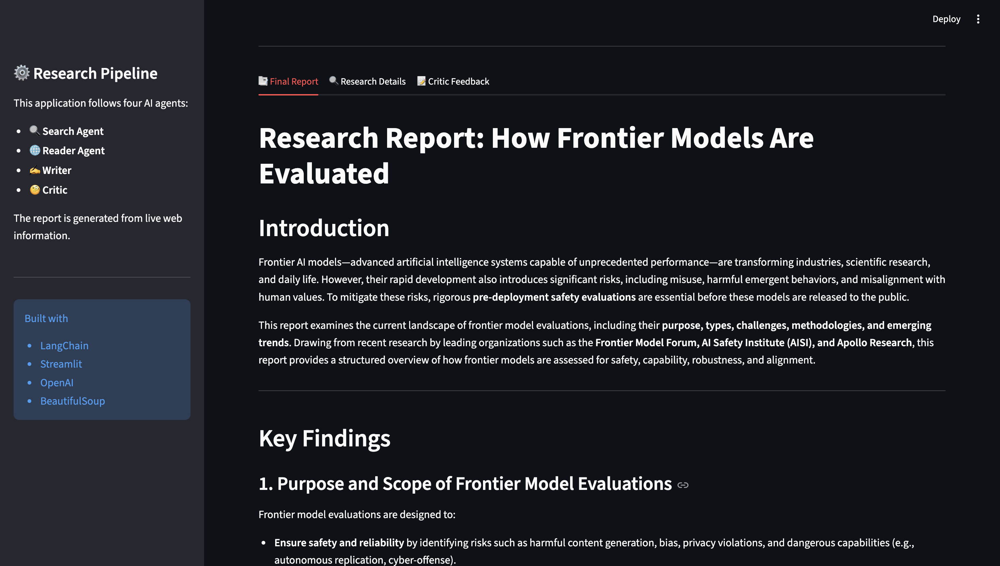
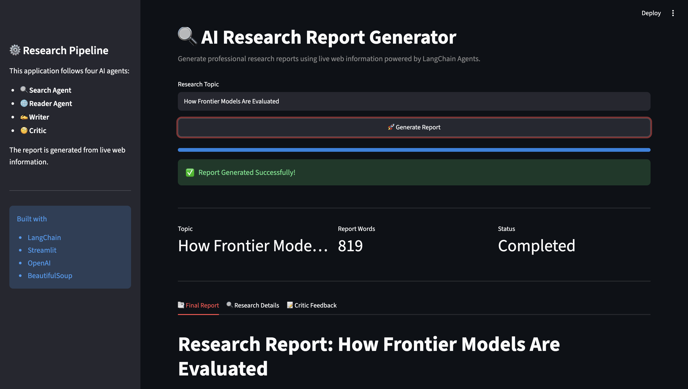
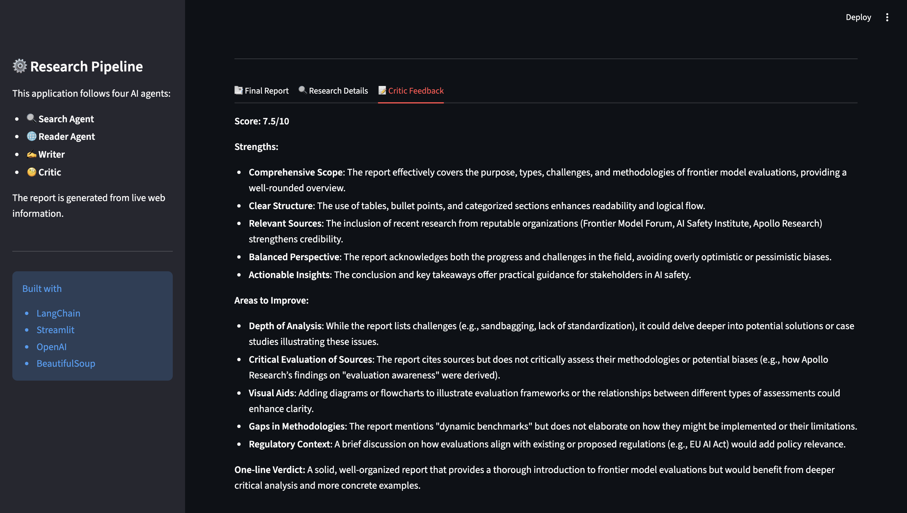

# 🔍 Multi-Agent AI Research System

A **Multi-Agent AI Research System** built with **LangChain**, **LangGraph**, and **Streamlit** that performs end-to-end research on any topic using live web data.

Instead of relying only on an LLM's knowledge, the system searches the web, extracts information from reliable sources, generates a structured research report, and reviews it for quality using multiple AI agents.

---

# 🚀 Features

* 🌐 Live web search for the latest information
* 🤖 Multi-agent architecture using LangChain
* 📄 Automatic content scraping from relevant sources
* ✍️ AI-generated structured research reports
* 🧐 Report quality review with a Critic Agent
* 📊 Interactive Streamlit dashboard
* 📥 Download generated reports
* ⚡ Real-time workflow updates

---

# 🏗️ Architecture

```
User Topic
     │
     ▼
┌─────────────────────┐
│  Search Agent       │
│ Finds latest data   │
└─────────┬───────────┘
          │
          ▼
┌─────────────────────┐
│ Reader Agent        │
│ Scrapes best source │
└─────────┬───────────┘
          │
          ▼
┌─────────────────────┐
│ Writer Agent        │
│ Generates report    │
└─────────┬───────────┘
          │
          ▼
┌─────────────────────┐
│ Critic Agent        │
│ Reviews report      │
└─────────┬───────────┘
          │
          ▼
    Final Research Report
```

---

# 🛠️ Tech Stack

* Python
* LangChain
* LangGraph
* Streamlit
* Mistral AI
* BeautifulSoup
* Requests
* Tavily Search (or your search provider)
* Rich

---

# 📂 Project Structure

```
multi-agent-ai-research-system/

│
├── app.py                  # Streamlit UI
├── pipeline.py             # Research pipeline
├── agent.py                # LangChain agents
├── tools.py                # Search & scraping tools
├── requirements.txt
└── README.md
```

---

# ⚙️ Installation

Clone the repository

```bash
git clone https://github.com/yourusername/multi-agent-ai-research-system.git

cd multi-agent-ai-research-system
```

Create a virtual environment

```bash
python -m venv venv
```

Activate the environment

### Windows

```bash
venv\Scripts\activate
```

### macOS/Linux

```bash
source venv/bin/activate
```

Install dependencies

```bash
pip install -r requirements.txt
```

---

# 🔑 Environment Variables

Create a `.env` file in the project root.

```env
MISTRAL_API_KEY=your_api_key
```

Add any additional API keys required by your search tools.

---

# ▶️ Run the Streamlit App

```bash
streamlit run app.py
```

---

# 💻 Run in Terminal

```bash
python pipeline.py
```

---

# 📋 Workflow

1. User enters a research topic.
2. Search Agent gathers the latest information from the web.
3. Reader Agent selects and scrapes the most relevant source.
4. Writer Agent generates a structured research report.
5. Critic Agent reviews the report and provides feedback.
6. The final report is displayed and can be downloaded.

---

# 📸 Screenshots

Add screenshots of your application here.









---

# 📄 License

This project is licensed under the MIT License.

---

# 👨‍💻 Author

**Vinayak Dhaybar**

Software Engineer | Full Stack Developer | AI Enthusiast

If you found this project helpful, consider giving it a ⭐ on GitHub.
